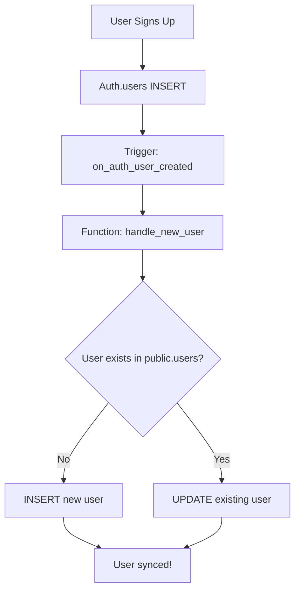

# 🔄 Auto-Sync Auth Users to Database - Complete Guide

## 🎯 What This Fixes

**Problem**: Auth users (Supabase Auth) are not automatically added to the `users` table, causing foreign key constraint errors when trying to:
- Send chat messages
- Approve/reject applications  
- Any operation requiring a user ID reference

**Solution**: Automatic synchronization of Supabase Auth users to the `users` table via database trigger.

---

## 🚀 Implementation Steps

### Step 1: Run the Migration SQL

1. Open [Supabase SQL Editor](https://supabase.com/dashboard/project/_/sql)
2. Copy **ALL** content from: `database/migrations/009_auto_sync_auth_users.sql`
3. Click **Run**
4. Wait for success messages

**What it does:**
- ✅ Makes `wallet_address` nullable (auth users don't have wallets initially)
- ✅ Adds `role` column to users table
- ✅ Creates trigger function `handle_new_user()`
- ✅ Creates trigger on `auth.users` table (fires on INSERT)
- ✅ **Backfills all existing auth users** into users table
- ✅ Sets up automatic sync for all future signups

---

## 📊 How It Works

### Database Trigger Flow



### What Gets Synced

From `auth.users` → To `public.users`:

| Auth Field | Users Field | Default |
|------------|-------------|---------|
| `id` | `id` | (same UUID) |
| `email` | `email` | - |
| `raw_user_meta_data->>'full_name'` | `full_name` | email if missing |
| `raw_user_meta_data->>'role'` | `role` | 'prospective_tenant' |
| `created_at` | `created_at` | - |
| `updated_at` | `updated_at` | - |

---

## 🔧 Frontend Updates

### AuthContext.tsx Changes

**Added role parameter to signUp:**
```typescript
signUp: (email: string, password: string, fullName: string, role?: string) => Promise<{ error?: any }>;

const signUp = async (email: string, password: string, fullName: string, role?: string) => {
  const { error } = await supabase.auth.signUp({
    email,
    password,
    options: {
      data: {
        full_name: fullName,
        role: role || 'prospective_tenant', // ✅ Passed to metadata
      },
    },
  });
  return { error };
};
```

### AuthWall.tsx Changes

**Now passes selected role to signUp:**
```typescript
const { error: signUpError } = await signUp(
  formData.email,
  formData.password,
  formData.fullName,
  role // ✅ Pass the selected role (manager or prospective_tenant)
);
```

---

## ✅ Verification Steps

### 1. Check Auth Users

```sql
SELECT id, email, raw_user_meta_data->>'role' as role
FROM auth.users
ORDER BY created_at DESC;
```

### 2. Check Public Users

```sql
SELECT id, email, full_name, role, wallet_address
FROM public.users
ORDER BY created_at DESC;
```

### 3. Verify Counts Match

```sql
SELECT 
  'Auth Users' as source,
  COUNT(*) as count
FROM auth.users
UNION ALL
SELECT 
  'Public Users' as source,
  COUNT(*) as count
FROM public.users;
```

**Expected**: Both counts should be equal!

### 4. Test New Signup

1. Go to signup page
2. Select "Manager" or "Tenant" role
3. Fill in details and submit
4. Check both tables - user should appear in both automatically

---

## 🎨 Benefits

### Before:
- ❌ Chat fails with FK constraint error
- ❌ Manual database entry required for each user
- ❌ Auth and database out of sync
- ❌ Users can't perform actions requiring user ID

### After:
- ✅ Chat works immediately after signup
- ✅ Zero manual intervention needed
- ✅ Auth and database always in sync
- ✅ All features work out of the box
- ✅ Existing users automatically backfilled

---

## 🔍 Troubleshooting

### Issue: Trigger not firing

**Check if trigger exists:**
```sql
SELECT * FROM pg_trigger WHERE tgname = 'on_auth_user_created';
```

**Re-create trigger:**
```sql
DROP TRIGGER IF EXISTS on_auth_user_created ON auth.users;
CREATE TRIGGER on_auth_user_created
  AFTER INSERT ON auth.users
  FOR EACH ROW
  EXECUTE FUNCTION public.handle_new_user();
```

### Issue: Function errors

**Check function exists:**
```sql
SELECT proname, prosrc 
FROM pg_proc 
WHERE proname = 'handle_new_user';
```

**View function code:**
```sql
\df+ public.handle_new_user
```

### Issue: Backfill didn't work

**Manually run backfill:**
```sql
INSERT INTO public.users (
  id, email, full_name, role, wallet_address, created_at, updated_at
)
SELECT 
  id,
  email,
  COALESCE(raw_user_meta_data->>'full_name', email) as full_name,
  COALESCE(raw_user_meta_data->>'role', 'prospective_tenant') as role,
  NULL as wallet_address,
  created_at,
  updated_at
FROM auth.users
ON CONFLICT (id) DO UPDATE SET
  email = EXCLUDED.email,
  updated_at = NOW();
```

---

## 📝 Migration Details

### Changes to Users Table

```sql
-- Before:
wallet_address TEXT UNIQUE NOT NULL  -- ❌ Required

-- After:
wallet_address TEXT UNIQUE           -- ✅ Nullable
role TEXT DEFAULT 'prospective_tenant' -- ✅ Added
```

### Trigger Function

```sql
CREATE OR REPLACE FUNCTION public.handle_new_user()
RETURNS TRIGGER AS $$
BEGIN
  INSERT INTO public.users (
    id, email, full_name, role, wallet_address, created_at, updated_at
  )
  VALUES (
    NEW.id,
    NEW.email,
    COALESCE(NEW.raw_user_meta_data->>'full_name', NEW.email),
    COALESCE(NEW.raw_user_meta_data->>'role', 'prospective_tenant'),
    NULL,
    NOW(),
    NOW()
  )
  ON CONFLICT (id) DO UPDATE SET
    email = EXCLUDED.email,
    full_name = COALESCE(EXCLUDED.full_name, users.full_name),
    role = COALESCE(EXCLUDED.role, users.role),
    updated_at = NOW();

  RETURN NEW;
END;
$$ LANGUAGE plpgsql SECURITY DEFINER;
```

---

## 🎯 Testing Checklist

After running the migration:

- [ ] Run SQL migration successfully
- [ ] Verify trigger exists
- [ ] Check existing users were backfilled
- [ ] Test new signup as "Manager"
- [ ] Test new signup as "Tenant"
- [ ] Verify user appears in both auth.users and public.users
- [ ] Test chat functionality (should work now!)
- [ ] Test approve/reject (should work now!)
- [ ] Verify role is correctly set

---

## 🚨 Important Notes

1. **One-time migration**: Run the SQL script only once
2. **Existing users**: Will be automatically backfilled
3. **Future users**: Will be automatically synced on signup
4. **No code changes needed**: Works with existing signup flow
5. **Wallet address**: Can be added later (now nullable)
6. **Role flexibility**: Defaults to 'prospective_tenant' if not specified

---

## 📊 Database Schema After Migration

### Users Table (Final State)

```sql
CREATE TABLE public.users (
    id UUID PRIMARY KEY,                    -- Same as auth.users.id
    email TEXT UNIQUE,                      -- Synced from auth
    full_name TEXT,                         -- From metadata
    role TEXT DEFAULT 'prospective_tenant', -- From metadata or default
    wallet_address TEXT UNIQUE,             -- Nullable, added later
    phone TEXT,
    profile_image_url TEXT,
    created_at TIMESTAMP WITH TIME ZONE,
    updated_at TIMESTAMP WITH TIME ZONE,
    is_active BOOLEAN DEFAULT TRUE
);
```

---

## 🎉 Success Indicators

You'll know it's working when:

1. ✅ New signups automatically create user records
2. ✅ Chat messages send without errors
3. ✅ Application approval works
4. ✅ No more FK constraint violations
5. ✅ User count matches in both tables

---

**Next Steps**: Run the migration and test! 🚀
