# Circle API Configuration for Real Blockchain Transactions

## ✅ Configuration Complete

Your Circle API has been successfully configured to process **REAL** blockchain transactions on Solana Devnet instead of simulated ones.

## Configuration Details

### Circle API Credentials
- **API Key**: `TEST_API_KEY:7b661defceeb7abe8c44baa5dce623ce:3fa1a97ff31b1869497402d4188b596d`
- **API Base URL**: `https://api-sandbox.circle.com`
- **Network**: Solana Devnet (SOL)
- **Mode**: Real blockchain transactions

### Environment Variables Updated
File: `backend/.env`

```env
CIRCLE_API_KEY=TEST_API_KEY:7b661defceeb7abe8c44baa5dce623ce:3fa1a97ff31b1869497402d4188b596d
BLOCKCHAIN_NETWORK=solana
```

## Changes Made

### 1. Updated Circle API Key
- Replaced old test key with your new Circle API key
- Added `SUPABASE_SERVICE_KEY` for RLS policy bypass

### 2. Modified Circle Payment Service
**File**: `backend/src/services/circlePaymentService.ts`

- **Removed simulation fallbacks** - All transactions now go through Circle API
- **Added comprehensive logging** for transaction tracking
- **Added API key validation** - Service will report configuration status
- **Real transaction enforcement** - Errors will be thrown if API key is missing

### 3. Fixed Environment Variable Loading
**File**: `backend/src/index.ts`

- Moved `dotenv.config()` **BEFORE** service imports
- Ensured Circle Payment Service receives the API key during initialization
- Added logging to verify environment variables are loaded correctly

### 4. Integrated Micropayment History UI
**File**: `frontend/src/components/MicropaymentHistory.tsx`

- Created comprehensive transaction tracking UI
- Added Solana Explorer links for blockchain verification
- Integrated into TenantDashboard with dedicated tab

## How to Verify Real Transactions

### 1. Test a Micropayment
1. Go to http://localhost:3000
2. Sign in as a tenant (John Doe)
3. Click "Send Micropayment" button
4. Enter:
   - Recipient: Property Manager
   - Amount: Any amount between $0.01 and $10.00
   - Purpose: "Test real transaction"
5. Submit the payment

### 2. Check Backend Logs
You should see:
```
🚀 Initiating REAL Circle API transfer...
   From Wallet: [wallet_id]
   To Address: [recipient_address]
   Amount: [amount] USDC
   Purpose: [purpose]
```

### 3. View on Blockchain
1. Go to the "Micropayments" tab
2. Find your transaction
3. Click the "View on Solscan" link
4. Verify the transaction on Solana Devnet blockchain

## Transaction Flow

```mermaid
graph LR
    A[User Initiates Payment] --> B[Frontend Validates]
    B --> C[POST /api/micropayments]
    C --> D[Backend Validates]
    D --> E[Circle Payment Service]
    E --> F[Circle API]
    F --> G[Solana Blockchain]
    G --> H[Transaction Hash]
    H --> I[Database Record]
    I --> J[Micropayment History UI]
    J --> K[Solscan Link]
```



## Expected Behavior

### ✅ Successful Transaction
```json
{
  "success": true,
  "data": {
    "id": "uuid",
    "transaction_hash": "real_solana_tx_hash",
    "status": "completed",
    "amount_usdc": 5.00,
    "network": "solana"
  }
}
```

### ❌ Failed Transaction (if API key invalid)
```json
{
  "success": false,
  "error": "Circle API key not configured. Please add CIRCLE_API_KEY to .env file."
}
```

## Solana Devnet Explorer

All transactions can be verified on:
- **Solscan Devnet**: `https://solscan.io/tx/{transaction_hash}?cluster=devnet`
- **Solana Explorer**: `https://explorer.solana.com/tx/{transaction_hash}?cluster=devnet`

## Testing Checklist

- [ ] Backend server running with Circle API configured message
- [ ] Environment variables loaded correctly (check logs)
- [ ] Micropayment form accepts amounts between $0.01 and $10.00
- [ ] Transaction submits without "Circle API key not configured" error
- [ ] Backend logs show "Initiating REAL Circle API transfer"
- [ ] Transaction hash starts with real blockchain hash (not "SIMULATED_")
- [ ] Micropayment History shows transaction
- [ ] Solscan link opens blockchain explorer with transaction details

## Troubleshooting

### Issue: "Circle API key not configured"
**Solution**: Restart the backend server to reload environment variables
```bash
cd backend
npm run dev
```

### Issue: "Invalid API key" from Circle
**Solution**: Verify the API key in `.env` matches exactly:
```
CIRCLE_API_KEY=TEST_API_KEY:7b661defceeb7abe8c44baa5dce623ce:3fa1a97ff31b1869497402d4188b596d
```

### Issue: Transaction shows "SIMULATED_" hash
**Solution**: This means the Circle API is not being called. Check:
1. API key is set correctly
2. Backend server was restarted after `.env` update
3. No errors in backend logs during payment

## Next Steps

1. **Test Regular Payments**: Run the RLS migration to enable full payment functionality
2. **Monitor Circle Dashboard**: Check https://console.circle.com for transaction logs
3. **Production Setup**: Replace test API key with production key when ready to go live

## Important Notes

⚠️ **Test API Key**: This is a Circle sandbox/test API key for Solana Devnet only
⚠️ **Real Blockchain**: All transactions are written to Solana Devnet blockchain
⚠️ **Transaction Fees**: Circle may charge fees for transactions (check Circle pricing)
⚠️ **Wallet Management**: Ensure sending wallets have sufficient USDC balance

## Support Resources

- **Circle Developer Docs**: https://developers.circle.com/docs
- **Circle Console**: https://console.circle.com
- **Solana Devnet Faucet**: https://faucet.solana.com (for test SOL)
- **USDC Test Tokens**: Contact Circle support for devnet USDC

---

**Status**: ✅ READY FOR TESTING
**Last Updated**: October 22, 2025
**Configuration**: Real blockchain transactions enabled
