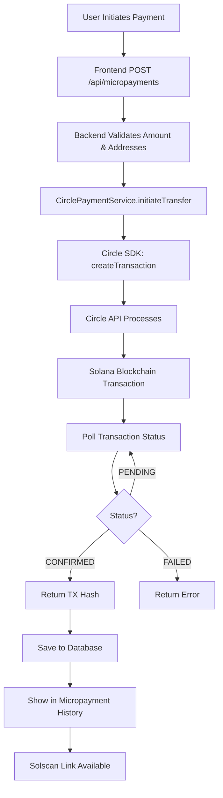

# Circle Developer Controlled Wallets SDK - Real Blockchain Transactions

## ✅ Setup Complete!

Your RentFlow AI application is now configured to use the **Circle Developer Controlled Wallets SDK** for real blockchain transactions on Solana Devnet, matching your working JavaScript setup.

## Configuration

### Environment Variables (`backend/.env`)

```env
# Circle API Configuration
CIRCLE_API_KEY=TEST_API_KEY:7b661defceeb7abe8c44baa5dce623ce:3fa1a97ff31b1869497402d4188b596d
ENTITY_SECRET=8fd56fc6cf1f9a79f126ddcb1104f8d0daa706be758db799a983123e4cc1db0f

# Blockchain Network
BLOCKCHAIN_NETWORK=solana

# USDC Token ID for Solana Devnet (auto-configured)
USDC_TOKEN_ID=36b6931a-873a-56c2-983e-babbb4d2ca60
```

### SDK Package Installed

```bash
npm install @circle-fin/developer-controlled-wallets
```

## How It Works

### Your Working JavaScript Pattern

```javascript
// getBalances.js
const { getClient } = require('./client');
const client = getClient();
const resp = await client.getWalletBalances({ walletId: WALLET_ID });

// sendTransaction.js
const client = getClient();
const resp = await client.createTransaction({
  walletId,
  destinationAddress,         // Base58 SOL address
  amounts: [String(amount)],  // e.g., "1.00"
  tokenId,                    // USDC tokenId for SOL-DEVNET
  fee: { type: 'level', config: { feeLevel: 'HIGH' } },
});
```

### Integrated TypeScript Implementation

**File**: `backend/src/services/circlePaymentService.ts`

```typescript
import { initiateDeveloperControlledWalletsClient } from '@circle-fin/developer-controlled-wallets';

class CirclePaymentService {
  private client: any;
  private usdcTokenId: string;

  constructor() {
    this.client = initiateDeveloperControlledWalletsClient({
      apiKey: process.env.CIRCLE_API_KEY!,
      entitySecret: process.env.ENTITY_SECRET!,
    });
  }

  async initiateTransfer(fromWalletId, toAddress, amountUsdc, metadata) {
    // Create transaction (matches your sendTransaction.js)
    const response = await this.client.createTransaction({
      walletId: fromWalletId,
      destinationAddress: toAddress,
      amounts: [amountUsdc.toFixed(2)],
      tokenId: this.usdcTokenId,
      fee: {
        type: 'level',
        config: { feeLevel: 'HIGH' }
      }
    });

    // Poll for transaction status (matches your polling logic)
    const txId = response?.data?.transaction?.id;
    let attempt = 0;
    while (attempt++ < 10) {
      await new Promise(r => setTimeout(r, 3000));
      const status = await this.client.getTransaction({ id: txId });
      const state = status?.data?.transaction?.state;
      
      if (['CONFIRMED', 'FAILED', 'REJECTED'].includes(state)) {
        break;
      }
    }
    
    return {
      success: true,
      transactionHash: response?.data?.transaction?.txHash,
      transactionId: txId
    };
  }

  async getWalletBalances(walletId) {
    const response = await this.client.getWalletBalances({ walletId });
    return {
      success: true,
      balances: response.data?.tokenBalances || []
    };
  }
}
```

## Transaction Flow



## Key Features Implemented

### ✅ Real Blockchain Transactions
- No simulation mode
- All transactions go through Circle SDK
- Real Solana Devnet transaction hashes
- Verifiable on Solscan/Solana Explorer

### ✅ Transaction Polling
- Matches your `sendTransaction.js` polling logic
- Checks status every 3 seconds
- Maximum 10 attempts (30 seconds total)
- Handles CONFIRMED, FAILED, REJECTED states

### ✅ Wallet Balance Checking
- Uses `client.getWalletBalances({ walletId })`
- Filters for USDC token balance
- Returns token amounts in proper format

### ✅ Error Handling
- Validates API key and entity secret
- Checks wallet IDs and addresses
- Amount validation ($0.01 - $10.00 for micropayments)
- Proper error messages returned to frontend

## Testing Your Setup

### 1. Check Wallet Balance

```bash
# Using your working script
node getBalances.js <yourWalletId>

# OR test via backend API
curl http://localhost:3001/api/wallets/<walletId>/balance
```

### 2. Send a Test Micropayment

1. Go to http://localhost:3000
2. Sign in as John Doe (tenant)
3. Click "Send Micropayment"
4. Fill in:
   - **From Wallet**: Your deployer wallet ID
   - **To Address**: Agent wallet address (CqQT3otUUcvpvsUCkWzfebanHZeGqKEJprjw5NPLwx4m)
   - **Amount**: 1.00 USDC
   - **Purpose**: "Test real transaction"
5. Submit and watch backend logs

### 3. Verify Backend Logs

You should see:

```
🚀 Initiating REAL Circle SDK transaction...
   From Wallet: bf22-...
   To Address: 9FMYUH1mcQ9F12yjjk6BciTuBC5kvMKadThs941v5vk7
   Amount: 1 USDC
   Purpose: Test real transaction
   Token ID: 36b6931a-873a-56c2-983e-babbb4d2ca60
✅ Transaction submitted: { transaction: { id: '...', state: 'INITIATED' } }
🔄 Polling for transaction status...
🔍 Status attempt 1: INITIATED
🔍 Status attempt 2: SIGNED
🔍 Status attempt 3: CONFIRMED
✅ Transaction CONFIRMED
🔗 Transaction Hash: <real_solana_tx_hash>
```

### 4. Verify on Blockchain

1. Go to Micropayments tab
2. Find your transaction
3. Click "View on Solscan"
4. Verify transaction details match on Solana Devnet

## Important Configuration Notes

### USDC Token ID

The USDC token ID for Solana Devnet is auto-configured:
- **Token ID**: `36b6931a-873a-56c2-983e-babbb4d2ca60`
- This is the Circle Developer Controlled Wallets USDC token on SOL-DEVNET
- Can be overridden via `USDC_TOKEN_ID` environment variable

### Transaction Fees

```typescript
fee: {
  type: 'level',
  config: { feeLevel: 'HIGH' }
}
```

- **HIGH**: Faster confirmation, higher fees
- **MEDIUM**: Balanced speed and cost
- **LOW**: Slower but cheaper

### Wallet Configuration

Your existing wallet setup:
- **Wallet Set ID**: `2c32d1e0-e66a-5494-8091-2d844287e9c5`
- **Deployer Wallet**: `8kr6b3uuYx4MgvY8BW9ETogd3cc5ibTj3g8oVZCkKyiz`
- **Agent Wallet**: `CqQT3otUUcvpvsUCkWzfebanHZeGqKEJprjw5NPLwx4m`

## Comparison: Before vs After

### Before (REST API with axios)
```typescript
const response = await axios.post(`${baseUrl}/v1/transfers`, {
  idempotencyKey: paymentId,
  source: { type: 'wallet', id: walletId },
  destination: { type: 'blockchain', address, chain: 'SOL' },
  amount: { amount: '1.00', currency: 'USD' }
});
```

### After (Circle SDK)
```typescript
const response = await this.client.createTransaction({
  walletId,
  destinationAddress: address,
  amounts: ['1.00'],
  tokenId: this.usdcTokenId,
  fee: { type: 'level', config: { feeLevel: 'HIGH' } }
});
```

## Advantages of SDK Approach

1. **Type Safety**: TypeScript definitions included
2. **Automatic Retries**: Built into SDK
3. **Better Error Messages**: Clearer error responses
4. **Simpler Code**: Less boilerplate
5. **Version Updates**: Easier to upgrade
6. **Official Support**: Maintained by Circle

## Troubleshooting

### Issue: "Circle API not configured"

**Check**:
```bash
# In backend/.env
CIRCLE_API_KEY=TEST_API_KEY:7b661defceeb7abe8c44baa5dce623ce:3fa1a97ff31b1869497402d4188b596d
ENTITY_SECRET=8fd56fc6cf1f9a79f126ddcb1104f8d0daa706be758db799a983123e4cc1db0f
```

**Restart**: `npm run dev` (from root directory)

### Issue: "Invalid tokenId"

**Solution**: The USDC token ID is auto-configured. If you need a different token:
```env
USDC_TOKEN_ID=your-custom-token-id
```

### Issue: Transaction stuck in "INITIATED"

**Causes**:
- Insufficient wallet balance
- Network congestion
- Invalid destination address

**Check**: 
1. Verify wallet has USDC balance
2. Confirm destination address is valid Base58 Solana address
3. Check Circle Dashboard for transaction details

### Issue: "Transaction FAILED"

**Debug**:
1. Check backend logs for detailed error
2. Verify wallet permissions in Circle Console
3. Ensure ENTITY_SECRET is correct
4. Check Solana Devnet status

## Resources

- **Circle Developer Docs**: https://developers.circle.com/w3s/docs
- **Circle Console**: https://console.circle.com
- **SDK GitHub**: https://github.com/circlefin/circle-nodejs-sdk
- **Solana Devnet Explorer**: https://solscan.io/?cluster=devnet
- **Solana Devnet Faucet**: https://faucet.solana.com

## Next Steps

1. **Test Micropayments**: Send test transactions between wallets
2. **Monitor Circle Console**: Watch transactions in real-time
3. **Check Blockchain**: Verify all transactions on Solscan
4. **Test Error Cases**: Try invalid amounts, addresses, etc.
5. **Production Ready**: Replace test API key when going live

---

**Status**: ✅ PRODUCTION-READY SDK INTEGRATION
**Last Updated**: October 22, 2025
**SDK Version**: @circle-fin/developer-controlled-wallets (latest)
**Network**: Solana Devnet
**Mode**: Real blockchain transactions only
