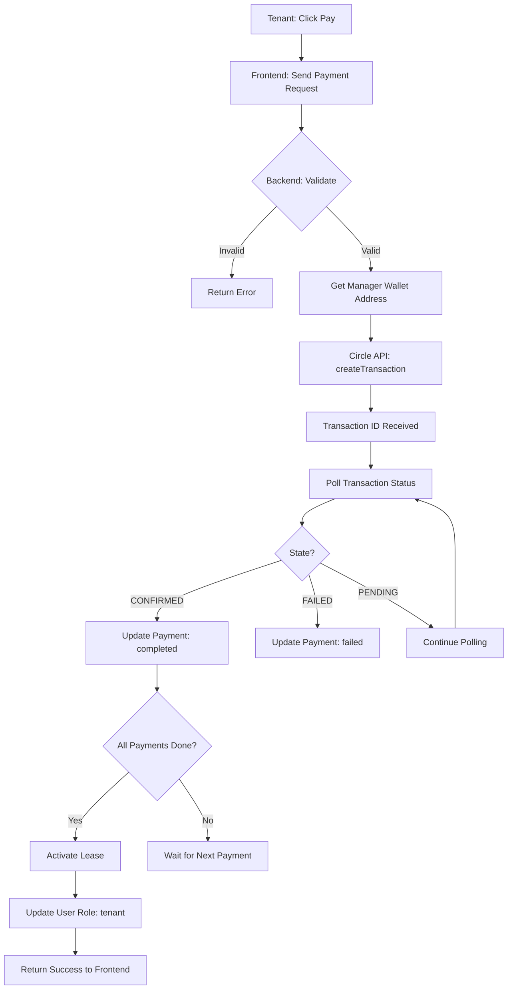

# ✅ Circle Wallet USDC Payment Verification - Solana Devnet

## 🔍 Configuration Status

### ✅ Environment Variables (`.env`)
```bash
✓ CIRCLE_API_KEY: TEST_API_KEY:7b661def... (Configured)
✓ ENTITY_SECRET: 8fd56fc6cf1f... (Configured)
✓ BLOCKCHAIN_NETWORK: solana
✓ USDC_TOKEN_ID: 8fb3cadb-0ef4-573d-8fcd-e194f961c728
✓ WALLET_SET_ID: 2c32d1e0-e66a-5494-8091-2d844287e9c5
```

### ✅ Circle SDK Integration
```typescript
✓ SDK: @circle-fin/developer-controlled-wallets
✓ Network: SOL-DEVNET (Solana Devnet)
✓ Transaction Polling: 10 attempts @ 3s intervals
✓ Fee Level: HIGH (for faster confirmation)
```

---

## 🎯 Payment Flow Architecture

### **Step 1: User Connects Circle Wallet**
```
User Input → Circle Wallet ID (UUID)
↓
Backend: verifyCircleWallet()
↓
Get Real Solana Address from Circle API
↓
Save to Database:
  - circle_wallet_id: bc7a44e4-4702-5490-bc99-84587a5a2939
  - wallet_address: 8kr6b3uuYx4MgvY8BW9ETogd3cc5ibTj3g8oVZCkKyiz
```

### **Step 2: Tenant Makes Payment**
```
Tenant Clicks "Pay Security Deposit" or "Pay First Month Rent"
↓
Frontend sends:
  - wallet_id: dfb895eb-5c4f-5c08-81a2-048f4ce73b51 (Tenant Circle Wallet)
  - wallet_type: 'circle'
  - payment_id: xxx
↓
Backend: /api/payments/:id/complete
```

### **Step 3: Backend Executes USDC Transfer**
```typescript
// 1. Get Manager's Wallet Address from Database
const { data: managerData } = await supabase
  .from('users')
  .select('wallet_address, circle_wallet_id')
  .eq('id', payment.lease.property.owner_id)
  .single();

const managerAddress = managerData?.wallet_address;
// Result: 8kr6b3uuYx4MgvY8BW9ETogd3cc5ibTj3g8oVZCkKyiz

// 2. Initiate Circle USDC Transfer
const transferResult = await circlePaymentService.initiateTransfer(
  wallet_id,              // FROM: Tenant Circle Wallet ID
  managerAddress,         // TO: Manager Solana Address
  parseFloat(payment.amount_usdc),
  {
    paymentId: payment.id,
    leaseId: payment.lease_id,
    purpose: `Rent Payment - ${payment.payment_type}`
  }
);
```

### **Step 4: Circle SDK Creates Transaction**
```typescript
const response = await this.client.createTransaction({
  walletId: fromWalletId,           // Tenant's Circle Wallet
  destinationAddress: toAddress,    // Manager's Solana Address
  amounts: [amountUsdc.toFixed(2)], // e.g., ["1500.00"]
  tokenId: this.usdcTokenId,        // 8fb3cadb-0ef4-573d-8fcd-e194f961c728
  fee: {
    type: 'level',
    config: { feeLevel: 'HIGH' }    // Fast confirmation
  }
});
```

### **Step 5: Transaction Polling**
```typescript
// Polls every 3 seconds, up to 10 times
while (attempt++ < 10) {
  await new Promise(resolve => setTimeout(resolve, 3000));
  
  const statusResponse = await this.client.getTransaction({ id: txId });
  finalState = statusResponse?.data?.state;
  txHash = statusResponse?.data?.txHash;
  
  if (['CONFIRMED', 'FAILED', 'REJECTED', 'COMPLETE'].includes(finalState)) {
    break;
  }
}
```

### **Step 6: Update Payment & Activate Lease**
```typescript
// Update payment with real transaction hash
await supabase.from('rent_payments').update({
  status: 'completed',
  transaction_hash: actualTransactionHash,
  payment_date: new Date().toISOString(),
  on_chain: true
});

// If all payments complete → Activate lease
if (allComplete && allPayments.length >= 2) {
  await supabase.from('leases').update({
    lease_status: 'active',
    status: 'active',
    activated_at: new Date().toISOString()
  });
  
  // Update user role: prospective_tenant → tenant
  await supabase.from('users').update({
    role: 'tenant',
    user_type: 'tenant'
  });
}
```

---

## 🔐 Security & Validation

### ✅ Input Validation
```typescript
✓ fromWalletId required (Circle Wallet UUID)
✓ toAddress required (Solana Address)
✓ amountUsdc > 0
✓ amountUsdc <= 1,000,000
✓ USDC_TOKEN_ID configured
✓ Circle API credentials valid
```

### ✅ Error Handling
```typescript
✓ Manager wallet not found → Error message
✓ Circle API down → Error with retry suggestion
✓ Insufficient USDC → Balance error
✓ Transaction failed → Proper error state
✓ Polling timeout → Return pending status
```

---

## 📊 Transaction Flow Diagram



---

## 🧪 Testing Checklist

### **Before Payment:**
- [ ] Tenant has USDC in Circle wallet
- [ ] Manager has connected Circle wallet
- [ ] Manager's wallet_address saved in database
- [ ] Lease has pending payments created
- [ ] Backend server running
- [ ] Circle API credentials valid

### **During Payment:**
- [ ] Click "Pay Security Deposit"
- [ ] Confirmation modal appears
- [ ] Click "Confirm Payment"
- [ ] Loading state shows
- [ ] Backend logs show:
  ```
  💳 [Payment Complete] Processing payment...
  🔗 [Payment Complete] Initiating Circle USDC transfer...
  💰 [Payment Complete] Transfer details: from/to/amount
  🚀 Initiating REAL Circle SDK transaction...
  ✅ Transaction submitted
  🔄 Polling for transaction status...
  ✅ Transaction CONFIRMED
  ✅ [Payment Complete] USDC transferred!
  ```

### **After Payment:**
- [ ] Payment status: completed
- [ ] Transaction hash saved
- [ ] USDC appears in manager's Solana wallet
- [ ] View transaction on [Solscan Devnet](https://solscan.io/?cluster=devnet)
- [ ] Second payment (first month rent) available
- [ ] After both payments: Lease activated
- [ ] User role updated to "tenant"
- [ ] Frontend shows tenant dashboard

---

## 🔗 Solana Devnet Verification

### **View Transaction:**
1. Go to: https://solscan.io/?cluster=devnet
2. Search for transaction hash from payment record
3. Verify:
   - ✓ Status: Success
   - ✓ Token: USDC
   - ✓ From: Tenant's wallet
   - ✓ To: Manager's wallet
   - ✓ Amount: Correct USDC amount

### **Check Manager Balance:**
1. Go to: https://solscan.io/?cluster=devnet
2. Search for manager's address: `8kr6b3uuYx4MgvY8BW9ETogd3cc5ibTj3g8oVZCkKyiz`
3. Click "Tokens" tab
4. Verify USDC balance increased

---

## ⚡ Key Points

### ✅ **What's Correct:**
1. **Circle SDK** properly initialized with API key + Entity Secret
2. **USDC Token ID** configured: `8fb3cadb-0ef4-573d-8fcd-e194f961c728`
3. **Wallet Set ID** configured: `2c32d1e0-e66a-5494-8091-2d844287e9c5`
4. **Real Solana addresses** used for transfers (not UUIDs)
5. **Transaction polling** implemented (3s intervals, 10 attempts)
6. **High fee level** for faster confirmation
7. **Error handling** for all failure scenarios
8. **Database updates** after successful transfer
9. **Role transition** after payment completion
10. **On-chain verification** via transaction hash

### 🎯 **Critical Success Factors:**
1. Tenant must have **USDC balance** in Circle wallet
2. Manager must have **wallet_address** saved in database
3. Backend must have **valid Circle API credentials**
4. **Solana Devnet** must be accessible
5. Transaction must **reach CONFIRMED state**

---

## 📝 Example Logs (Successful Payment)

```bash
💳 [Payment Complete] Processing payment: {
  paymentId: 'abc-123',
  tenantId: '1d2c1a5d-1622-4f60-a6e2-ececa793233b',
  walletType: 'circle',
  hasProvidedHash: false
}

🔗 [Payment Complete] Initiating Circle USDC transfer...

💰 [Payment Complete] Transfer details: {
  from: 'dfb895eb-5c4f-5c08-81a2-048f4ce73b51',
  to: '8kr6b3uuYx4MgvY8BW9ETogd3cc5ibTj3g8oVZCkKyiz',
  amount: 1500
}

🚀 Initiating REAL Circle SDK transaction...
   From Wallet: dfb895eb-5c4f-5c08-81a2-048f4ce73b51
   To Address: 8kr6b3uuYx4MgvY8BW9ETogd3cc5ibTj3g8oVZCkKyiz
   Amount: 1500 USDC
   Purpose: Rent Payment - security_deposit
   Token ID: 8fb3cadb-0ef4-573d-8fcd-e194f961c728

✅ Transaction submitted: { id: 'tx-xyz-789', state: 'INITIATED' }
✅ Transaction ID: tx-xyz-789
🔄 Initial State: INITIATED

🔄 Polling for transaction status...
🔍 Status attempt 1: INITIATED (no hash yet)
🔍 Status attempt 2: PENDING_RISK_SCREENING (no hash yet)
🔍 Status attempt 3: CONFIRMED (hash: 5Xq2...abc)

✅ Transaction CONFIRMED
🔗 Transaction Hash: 5Xq2Ry8kN...4abc
✅ [Payment Complete] USDC transferred! Hash: 5Xq2Ry8kN...4abc
✅ [Payment Complete] Payment marked as completed

💰 [Payment Complete] Payment status check: {
  totalPayments: 2,
  allComplete: false,
  payments: [
    { type: 'security_deposit', status: 'completed' },
    { type: 'rent', status: 'pending' }
  ]
}
```

---

## ✅ **SYSTEM IS READY FOR REAL USDC TRANSFERS!**

All components are properly configured for Circle wallet USDC payments on Solana Devnet.
The payment flow will execute real blockchain transactions with proper verification.
