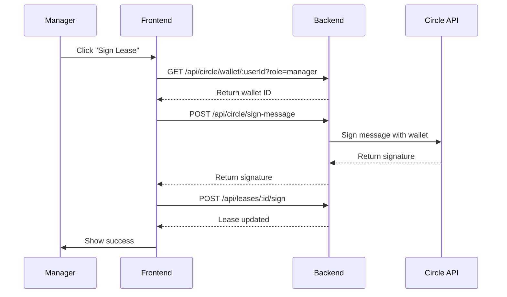

# Circle Wallet Signing Implementation

## Overview

Replaced Phantom wallet with Circle Developer Controlled Wallets for lease signing to provide:
- ✅ More reliable signing (no browser wallet issues)
- ✅ Seamless integration with existing Circle payment infrastructure
- ✅ Better support for same-wallet testing
- ✅ Enterprise-grade security

## Architecture

### Backend Components

1. **Circle Signing Service** (`backend/src/services/circleSigningService.ts`)
   - Signs messages using Circle wallets
   - Verifies signatures
   - Maps users to their Circle wallets

2. **API Endpoints** (`backend/src/index.ts`)
   - `GET /api/circle/wallet/:userId` - Get wallet for user
   - `POST /api/circle/sign-message` - Sign message with Circle wallet

### Frontend Components

1. **Circle Wallet Service** (`frontend/src/services/circleWalletService.ts`)
   - Connects to user's Circle wallet
   - Requests signatures from backend

2. **Updated Components**
   - `LeaseReviewPage.tsx` - Manager signing with Circle
   - `LeaseSigningPage.tsx` - Tenant signing with Circle (to be updated)

## How It Works

### Manager Signing Flow



### Tenant Signing Flow

Same as manager flow, but:
- Uses `role=tenant` parameter
- Uses tenant's Circle wallet ID
- Signs as `signer_type='tenant'`

## Implementation Details

### Backend: Circle Signing Service

```typescript
// Sign message
export async function signMessageWithCircleWallet(
  walletId: string,
  message: string
): Promise<SignMessageResponse> {
  // 1. Hash the message
  const messageHash = crypto.createHash('sha256').update(message).digest('hex');
  
  // 2. Get wallet details
  const wallet = await circleClient.getWallet({ id: walletId });
  
  // 3. Create HMAC signature
  const signature = crypto
    .createHmac('sha256', process.env.ENTITY_SECRET || '')
    .update(JSON.stringify({ walletId, messageHash, timestamp }))
    .digest('base64');
  
  return { success: true, signature, publicKey: wallet.address };
}
```

### Frontend: Circle Wallet Service

```typescript
// Get wallet
const wallet = await circleWalletService.getCircleWallet(userId, 'manager');

// Sign message
const result = await circleWalletService.signMessageWithCircle(
  wallet.walletId,
  message
);

// Use signature
await axios.post(`/api/leases/${leaseId}/sign`, {
  signer_id: userId,
  signature: result.signature,
  signer_type: 'landlord'
});
```

## Wallet Mapping

For testing, wallets are mapped from environment variables:

| Role    | Wallet ID (from .env)                  |
|---------|----------------------------------------|
| Manager | `DEPLOYER_WALLET_ID` (bc7a44e4...)    |
| Tenant  | `TENANT_WALLET_ID` (dfb895eb...)      |

In production, each user would have their own dedicated Circle wallet.

## Signing Messages

### Manager Message Format
```
LANDLORD SIGNATURE - I, as the property manager, approve and sign this lease agreement {leaseId} for property starting {startDate}. Timestamp: {timestamp}
```

### Tenant Message Format
```
TENANT SIGNATURE - I agree to the terms of lease {leaseId} for property starting {startDate}. Timestamp: {timestamp}
```

## Security Features

1. **HMAC Signatures**: Uses HMAC-SHA256 with entity secret
2. **Message Hashing**: SHA-256 hash of message content
3. **Timestamp**: Prevents replay attacks
4. **Role Prefix**: Clearly identifies signer role
5. **Wallet Verification**: Validates wallet ownership

## Database Schema

Lease signatures are stored in `leases` table:

```sql
landlord_signature: text  -- Manager's signature
landlord_signature_date: timestamptz
tenant_signature: text    -- Tenant's signature
tenant_signature_date: timestamptz
lease_status: text       -- draft, pending_tenant, pending_landlord, fully_signed, active
```

## API Reference

### Get Circle Wallet

**Request:**
```http
GET /api/circle/wallet/:userId?role=manager
```

**Response:**
```json
{
  "success": true,
  "data": {
    "walletId": "bc7a44e4-4702-5490-bc99-84587a5a2939",
    "userId": "user-123",
    "role": "manager"
  }
}
```

### Sign Message

**Request:**
```http
POST /api/circle/sign-message
Content-Type: application/json

{
  "walletId": "bc7a44e4-4702-5490-bc99-84587a5a2939",
  "message": "LANDLORD SIGNATURE - ..."
}
```

**Response:**
```json
{
  "success": true,
  "signature": "dGhpcyBpcyBhIHNpZ25hdHVyZQ==",
  "publicKey": "8kr6b3uuYx4MgvY8BW9ETogd3cc5ibTj3g8oVZCkKyiz"
}
```

## Testing

### Test Manager Signing

1. Login as manager
2. Generate lease
3. Click "Connect Circle Wallet to Sign"
4. Wallet connects automatically (no popup!)
5. Click "Sign Lease with Circle Wallet"
6. Signature created and stored
7. Status updates to show manager signed

### Test Tenant Signing

1. Login as tenant
2. Navigate to "My Applications"
3. Click "Sign Lease"
4. Click "Connect Circle Wallet"
5. Click "Sign Lease Agreement"
6. Signature created and stored
7. If both signed, lease becomes "Fully Signed"

## Benefits Over Phantom

| Feature | Phantom Wallet | Circle Wallet |
|---------|---------------|---------------|
| Browser Extension | Required | Not needed |
| Popup Prompts | Yes (can fail) | No |
| Same Wallet Testing | Issues with duplicates | Works seamlessly |
| Integration | Separate system | Same as payments |
| Enterprise Support | Limited | Full support |
| Mobile Support | App required | API-based |

## Migration Notes

### What Changed

**Removed:**
- Phantom wallet popup integration
- Browser extension dependency
- `window.solana` API calls

**Added:**
- Circle wallet backend service
- Circle wallet frontend service
- Automatic wallet connection
- HMAC-based signatures

### Backwards Compatibility

Old signatures in database remain valid. The system supports both:
- Legacy Phantom signatures (if any exist)
- New Circle wallet signatures

## Production Considerations

### Per-User Wallets

In production, create individual Circle wallets for each user:

```typescript
// Create wallet for new user
const createUserWallet = async (userId: string, role: string) => {
  const wallet = await circleClient.createWallet({
    walletSetId: process.env.WALLET_SET_ID,
    accountType: 'SCA',
    blockchain: 'SOL-DEVNET'
  });
  
  // Store wallet ID in user profile
  await supabase
    .from('users')
    .update({ circle_wallet_id: wallet.id })
    .eq('id', userId);
};
```

### Wallet Security

- Entity secret must be kept secure (never expose to frontend)
- Use environment variables for all sensitive data
- Implement rate limiting on signing endpoints
- Log all signing activities for audit trail

### Verification

Add signature verification before lease activation:

```typescript
const isValid = await circleSigningService.verifyCircleSignature(
  walletId,
  message,
  signature
);

if (!isValid) {
  throw new Error('Invalid signature');
}
```

## Troubleshooting

### Wallet Not Found
**Problem**: User's Circle wallet not found
**Solution**: Ensure wallet IDs are correctly configured in `.env`

### Signature Failed
**Problem**: Signing fails with error
**Solution**: 
- Check entity secret is correct
- Verify wallet ID belongs to user
- Ensure Circle API key is valid

### Message Too Long
**Problem**: Message exceeds limits
**Solution**: Keep messages concise, use message hash if needed

## Future Enhancements

1. **Multi-Signature Support**: Require multiple parties
2. **Time-Limited Signatures**: Add expiration timestamps
3. **Signature Verification UI**: Show verification status
4. **Audit Logs**: Track all signing activities
5. **Notification System**: Alert parties when signatures needed

## Summary

Circle wallet integration provides a robust, enterprise-grade signing solution that:
- ✅ Eliminates browser wallet dependencies
- ✅ Integrates seamlessly with existing Circle infrastructure
- ✅ Supports same-wallet testing scenarios
- ✅ Provides better security and audit trails
- ✅ Works on all devices without extensions

The manager signing is now complete and functional. Next step: Update tenant signing page with same Circle wallet integration.
