# Micropayment Circle API Integration Fix

## 🔴 Issue Identified

**Error**: "Request failed with status code 400" from Circle API

**Root Cause**: The micropayment endpoint was passing Solana wallet addresses for BOTH parameters:
```typescript
// ❌ INCORRECT - Both parameters are Solana addresses
circlePaymentService.initiateTransfer(
  fromUser.wallet_address,  // Solana address (Base58)
  toUser.wallet_address,    // Solana address (Base58)
  amount,
  metadata
);
```

According to Circle's Developer Controlled Wallets documentation, `createTransaction` requires:
- **`walletId`**: Circle wallet ID (UUID format, e.g., `bc7a44e4-4702-5490-bc99-84587a5a2939`)
- **`destinationAddress`**: Blockchain address (Solana Base58 address is correct here)

## ✅ Solution Applied

Updated the micropayment endpoint to use the deployer Circle wallet ID:

```typescript
// ✅ CORRECT - First parameter is Circle wallet ID, second is Solana address
const deployerWalletId = process.env.DEPLOYER_WALLET_ID;  // UUID format

circlePaymentService.initiateTransfer(
  deployerWalletId,          // Circle wallet ID (UUID)
  toUser.wallet_address,     // Destination Solana address (Base58)
  amount,
  metadata
);
```

### Changes Made

**File**: `backend/src/index.ts` (line ~2569)

```typescript
// Added deployer wallet ID check
const deployerWalletId = process.env.DEPLOYER_WALLET_ID;

if (!deployerWalletId) {
  return res.status(500).json({
    success: false,
    error: 'Circle wallet configuration missing. Contact system administrator.'
  });
}

console.log('   Using Deployer Wallet ID:', deployerWalletId);

// Use deployer wallet as sender (for testing)
const paymentResult = await circlePaymentService.initiateTransfer(
  deployerWalletId,         // ✅ Circle wallet ID
  toUser.wallet_address,    // ✅ Solana address
  amount,
  { ... }
);
```

## 🔧 Environment Configuration

The fix uses this environment variable:
```env
DEPLOYER_WALLET_ID=bc7a44e4-4702-5490-bc99-84587a5a2939
```

This is set in `backend/.env` and points to your Circle Developer Controlled Wallet.

## 📊 How It Works Now

```mermaid
graph LR
    A[User Sends Micropayment] --> B[Backend receives request]
    B --> C[Get recipient Solana address from DB]
    C --> D[Use DEPLOYER_WALLET_ID from env]
    D --> E[Call circlePaymentService.initiateTransfer]
    E --> F[Circle SDK: createTransaction]
    F --> G{Circle API Validates}
    G -->|✅ Valid| H[Create blockchain transaction]
    G -->|❌ Invalid| I[Return error 400]
    H --> J[Poll transaction status]
    J --> K[Return transaction hash]
    K --> L[Save to database]
```



## 🧪 Testing

### Before Fix
```json
{
  "error": "Request failed with status code 400",
  "circle_error": {
    "code": 2,
    "message": "API parameter invalid"
  }
}
```

### After Fix
The transaction should now:
1. ✅ Accept the Circle wallet ID correctly
2. ✅ Create a transaction on Solana Devnet
3. ✅ Return a real transaction hash
4. ✅ Save to database successfully

## 🔮 Future Enhancement: User-Specific Wallets

Currently, all micropayments send FROM the deployer wallet. In production, you should:

### Step 1: Add Circle Wallet ID to Users Table

```sql
ALTER TABLE users 
ADD COLUMN circle_wallet_id UUID;

CREATE INDEX idx_users_circle_wallet ON users(circle_wallet_id);
```

### Step 2: Create Circle Wallet for Each User

When a new user signs up:
```typescript
// Create Circle wallet for user
const walletResult = await circlePaymentService.createWallet(
  userId,
  `Wallet for ${user.full_name}`
);

// Store in database
await supabase
  .from('users')
  .update({ circle_wallet_id: walletResult.walletId })
  .eq('id', userId);
```

### Step 3: Update Micropayment Endpoint

```typescript
// Get sender's Circle wallet ID from database
const { data: fromUser } = await supabase
  .from('users')
  .select('circle_wallet_id, wallet_address')
  .eq('id', fromUserId)
  .single();

if (!fromUser.circle_wallet_id) {
  return res.status(400).json({
    error: 'Sender does not have a Circle wallet. Please set up payment method.'
  });
}

// Use sender's Circle wallet ID
const paymentResult = await circlePaymentService.initiateTransfer(
  fromUser.circle_wallet_id,  // Sender's Circle wallet
  toUser.wallet_address,       // Recipient's Solana address
  amount,
  metadata
);
```

## 📚 Circle API Documentation Reference

Based on your working JavaScript setup:

### createTransaction Parameters

```typescript
client.createTransaction({
  walletId: string,              // ✅ Circle wallet ID (UUID format)
  destinationAddress: string,    // ✅ Blockchain address (Base58 for Solana)
  amounts: string[],             // ✅ Array of amounts ["1.00"]
  tokenId: string,               // ✅ USDC token ID for network
  fee: {
    type: 'level',
    config: { feeLevel: 'HIGH' | 'MEDIUM' | 'LOW' }
  }
})
```

### Key Points

1. **walletId** must be a Circle wallet UUID, not a blockchain address
2. **destinationAddress** is the blockchain address (Solana/Ethereum/etc)
3. **tokenId** identifies which token (USDC on which network)
4. **amounts** must be an array of strings, not numbers

## 🎯 Current Status

### ✅ What Works Now
- Supabase connection (fixed with new service key)
- Circle API SDK integration
- Environment variables loaded correctly
- USDC token ID configured for Solana Devnet

### ⚠️ Temporary Workaround
- All micropayments send FROM deployer wallet
- Users can only RECEIVE micropayments
- Need to add Circle wallet IDs to user table for full functionality

### 🔜 Next Steps
1. Test micropayment with the fix
2. Verify transaction appears on Solana Devnet
3. Add Circle wallet creation for users
4. Update database schema with `circle_wallet_id` column

## 🐛 Debugging

If you still get errors, check:

### 1. Environment Variables
```bash
echo $DEPLOYER_WALLET_ID
# Should output: bc7a44e4-4702-5490-bc99-84587a5a2939
```

### 2. Backend Logs
Look for:
```
✅ Processing micropayment through Circle API...
   Using Deployer Wallet ID: bc7a44e4-4702-5490-bc99-84587a5a2939
   To Solana Address: 4Ugn6vamVywNM8iPSKDXPTVnmhJf6v8P45HtEu4PwfLV
🚀 Initiating REAL Circle SDK transaction...
```

### 3. Circle API Response
If it fails, the error should now be more specific:
```json
{
  "code": 155,
  "message": "Wallet not found"
}
```

This would mean the `DEPLOYER_WALLET_ID` doesn't exist in your Circle account.

## 📞 Support

If issues persist, provide:
1. Backend console logs (full transaction attempt)
2. Circle API error response
3. Screenshot of Circle Console showing wallet ID

---

**Status**: ✅ Fix Applied - Ready for Testing  
**Date**: October 22, 2025  
**Version**: Circle Developer Controlled Wallets SDK v9.1.0
