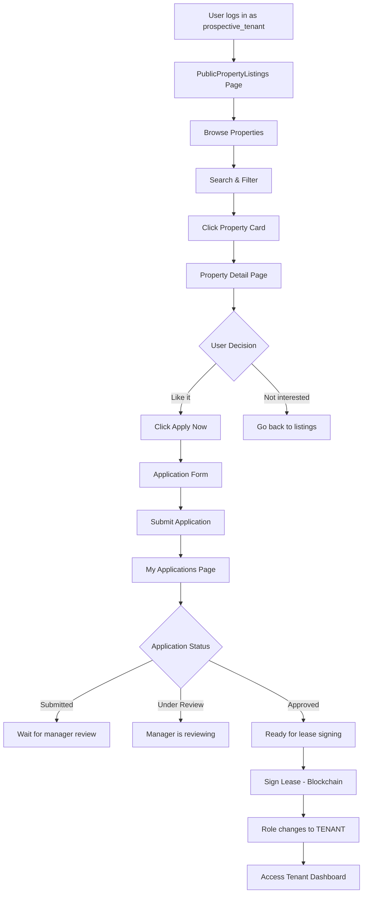

# 🔀 Prospective Tenant Routing Logic

## ✅ Current Implementation

### Role-Based Routing in App.tsx (Lines 1706-1720)

```typescript
if (userProfile.role === 'tenant') {
  console.log('✅ [App.tsx] Role is TENANT - Showing TenantDashboard');
  return <TenantDashboard />;
}

if (userProfile.role === 'prospective_tenant') {
  console.log('✅ [App.tsx] Role is PROSPECTIVE_TENANT - Showing PublicPropertyListings');
  return <PublicPropertyListings />;
}

console.log('✅ [App.tsx] Role is MANAGER (or default) - Showing Manager Dashboard');
return <Dashboard />;  // Manager Dashboard
```

---

## 🎯 What Prospective Tenants See

When a user with `role = 'prospective_tenant'` logs in, they see the **PublicPropertyListings** component.

### Main Features:

#### 1. **Header with Branding**
- RentFlow AI logo
- Tagline: "Find your perfect home on the blockchain"
- Login/Signup buttons (for logged-out users)

#### 2. **Search & Filter System**
- **Search bar**: Search by city, address, or property name
- **Filters**:
  - 🏠 Property Type (apartment, house, condo, studio)
  - 💰 Max Rent (USDC)
  - 🛏️ Min Bedrooms (0-4+)
  - ↻ Clear Filters button

#### 3. **Property Cards Grid**
Each property card shows:
- **Image**: Property photo with hover effects
- **Badges**:
  - Property type
  - Pet friendly (if applicable)
- **Details**:
  - Title
  - Location (city, state)
  - Description preview
  - Bedrooms, bathrooms, square feet
  - Amenities (first 3, with "+X more")
  - **Price in USDC** per month
  - View count & application count
- **Actions**:
  - ❤️ Save button (favorite)
  - "View Details" button → navigates to `/property/:id`

#### 4. **Property Detail View** (`/property/:id`)
When clicking a property:
- Full property details
- AI-generated description
- Virtual tour support
- **"Apply Now" button** → Opens auth wall if not logged in
- If logged in as prospective_tenant → Can submit application

#### 5. **Application Functionality**
Routes available:
- `/property/:id` - View property details
- `/apply/:id` - Submit application form
- `/my-applications` - View submitted applications

#### 6. **Footer CTA**
- Call to action: "Ready to find your next home?"
- Sign up / Sign in buttons
- Blockchain badges (Solana, USDC)

---

## 🔄 User Journey Flow



---

## 🚫 What Prospective Tenants CANNOT Access

### Blocked Features:
- ❌ **Tenant Dashboard** (requires active lease)
  - Rent payments
  - Maintenance requests
  - Lease documents
  - Voice notifications
  
- ❌ **Manager Dashboard** (requires manager role)
  - Property management
  - Application review
  - Lease creation
  - Analytics

### What They CAN Access:
- ✅ Browse all published properties
- ✅ Search and filter properties
- ✅ View property details
- ✅ Submit applications
- ✅ View their own applications (`/my-applications`)
- ✅ Track application status

---

## 📋 Application States for Prospective Tenants

| Status | What It Means | Next Steps |
|--------|---------------|------------|
| **submitted** | Application sent to manager | Wait for review |
| **under_review** | Manager is reviewing | Wait for decision |
| **approved** | Application accepted ✅ | Wait for lease creation |
| **rejected** | Application denied ❌ | Try other properties |
| **withdrawn** | Applicant cancelled | Can apply elsewhere |

---

## 🔄 Role Transition Logic

### From Prospective Tenant → Tenant

**Trigger**: Lease signing completed

**Process**:
1. Manager approves application
2. Manager creates lease for approved applicant
3. Both parties sign lease (blockchain signatures)
4. **Backend automatically updates** user role:
   ```sql
   UPDATE users 
   SET role = 'tenant', 
       user_type = 'tenant'
   WHERE id = applicant_id;
   ```
5. User can now access Tenant Dashboard
6. Can pay rent, submit maintenance, etc.

**Important**: Role transition happens ONLY after blockchain lease signing, not just approval.

---

## 🎨 UI/UX Features

### Design Elements:
- **Gradient backgrounds**: Blue to indigo theme
- **Hover effects**: Cards lift and scale on hover
- **Badges**: Property type, pet-friendly status
- **Stats**: View count, application count
- **Responsive**: Mobile, tablet, desktop layouts
- **Loading states**: Spinner while fetching data
- **Empty states**: "No properties found" with reset button

### Interactive Elements:
- ❤️ Save/favorite button (TODO: implement save functionality)
- 🔍 Real-time search filtering
- 🎛️ Advanced filters with toggle panel
- 📊 Property statistics footer
- 🖼️ Image hover zoom effect

---

## 🔗 Available Routes for Prospective Tenants

| Route | Component | Purpose |
|-------|-----------|---------|
| `/` | PublicPropertyListings | Browse properties |
| `/property/:id` | PropertyDetail | View property details |
| `/apply/:id` | PropertyApplicationForm | Submit application |
| `/my-applications` | MyApplications | View application status |
| `/login` | AuthWall (login mode) | Sign in |
| `/signup` | AuthWall (signup mode) | Create account |

---

## 📊 API Endpoints Used

| Endpoint | Purpose | Data Returned |
|----------|---------|---------------|
| `GET /api/properties/public` | Fetch all published properties | Property list |
| `GET /api/properties/:id` | Get property details | Single property |
| `POST /api/applications` | Submit application | Application record |
| `GET /api/applications/my-applications?user_id=X` | Get user's applications | User's application list |

---

## ✨ Key Features Summary

### For Prospective Tenants:

1. **Browse & Search**
   - View all available properties
   - Search by location, name
   - Filter by type, price, bedrooms
   - See property stats (views, applications)

2. **Property Details**
   - Full property information
   - AI-generated descriptions
   - Virtual tour support
   - Amenities list
   - Pricing in USDC

3. **Application System**
   - Submit rental applications
   - AI compatibility scoring
   - Track application status
   - View AI analysis results

4. **Profile Management**
   - Save favorite properties (in progress)
   - View application history
   - Update profile information

---

## 🚀 Next Steps After Login

**As prospective_tenant, users should:**

1. ✅ Browse available properties
2. ✅ Use search and filters to find suitable homes
3. ✅ Click properties to view details
4. ✅ Submit applications for properties they like
5. ✅ Check `/my-applications` to track status
6. ⏳ Wait for manager to review
7. ⏳ If approved, wait for lease creation
8. ⏳ Sign lease (blockchain)
9. ✅ Role upgrades to 'tenant'
10. ✅ Access full tenant dashboard

---

## 🐛 Common Issues & Solutions

### Issue 1: User sees blank page after login
**Cause**: Role not set to 'prospective_tenant' in database  
**Solution**: Run `FIX_ROLE_CONSTRAINT.sql` to update constraints and user records

### Issue 2: Can't see any properties
**Cause**: No published properties in database  
**Solution**: Manager needs to create and publish properties

### Issue 3: "Apply Now" doesn't work
**Cause**: Auth wall blocking or missing application endpoint  
**Solution**: Verify user is logged in and application endpoint exists

### Issue 4: Applications not showing
**Cause**: Applications not linked to user ID  
**Solution**: Check `/my-applications?user_id=X` has correct user ID

---

## 💡 Recommended Improvements

### Future Enhancements:

1. **Save/Favorite Properties**
   - Implement the heart button functionality
   - Store in `saved_properties` table
   - Show saved properties on profile page

2. **Advanced Filters**
   - Price range slider
   - Parking required
   - Pet-friendly only
   - Move-in date availability

3. **Property Comparison**
   - Select multiple properties
   - Side-by-side comparison
   - Feature matrix

4. **Notifications**
   - New property alerts
   - Application status updates
   - Price drop notifications

5. **Virtual Tours**
   - 360° property views
   - Video walkthroughs
   - Interactive floor plans

---

## ✅ Verification Checklist

After creating prospective tenant accounts, verify:

- [ ] User can login with demo credentials
- [ ] PublicPropertyListings page loads
- [ ] Properties are displayed in grid
- [ ] Search and filters work
- [ ] Can click property to view details
- [ ] "Apply Now" shows application form
- [ ] Can submit application
- [ ] Application appears in "My Applications"
- [ ] AI scores are displayed
- [ ] Application status is tracked

---

**Status**: ✅ Routing is correctly implemented  
**Component**: PublicPropertyListings.tsx  
**Role Required**: 'prospective_tenant'  
**Next Step**: Create demo accounts and test the flow!
