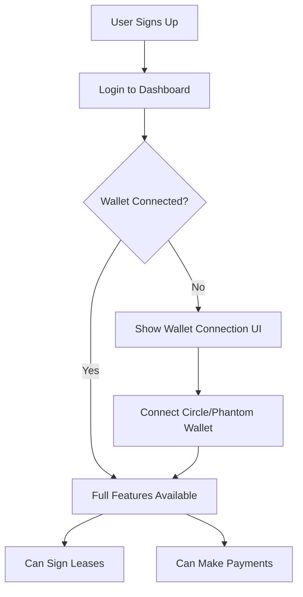

# Image Upload & Real Wallet Connection Implementation

## ✅ Implementation Summary

Two major features have been implemented to improve the real-time testing experience:

---

## 1. 📸 **Manager Property Image Uploads**

### What Changed:
- ✅ Managers can now upload their own property images instead of using pre-selected defaults
- ✅ Image preview with validation (max 5MB, image formats only)
- ✅ Base64 encoding for easy storage
- ✅ Remove/replace image functionality

### Frontend Changes:
**File**: `frontend/src/components/PropertyForm.tsx`
- Added `image_url` field to Property interface
- Added image file upload input with drag-and-drop styling
- Added image preview with remove button
- Added file validation (type and size)
- Image converted to base64 on submit

### Backend Changes:
**Migration**: `database/migrations/012_add_property_images.sql`
- Added `image_url TEXT` column to properties table
- Created index for properties with images
- Added documentation comment

### Database Schema:
```sql
ALTER TABLE properties
ADD COLUMN IF NOT EXISTS image_url TEXT;
```

### How to Use:
1. Manager creates or edits a property
2. Click "Click to upload property image" area
3. Select an image (PNG, JPG, max 5MB)
4. Preview appears with option to remove/replace
5. Submit form - image saved as base64 in database

---

## 2. 🔐 **Remove Default Wallets - Real Wallet Connection Required**

### What Changed:
- ❌ **REMOVED** all default/pre-configured wallet assignments
- ✅ Users **MUST** connect their own Circle or Phantom wallet
- ✅ No automatic wallet creation on signup
- ✅ Wallet connection required before lease signing or payments

### Backend Changes:
**File**: `backend/src/services/circleSigningService.ts`

#### Before:
```typescript
// Used environment variables for default wallets
const walletId = role === 'manager' 
  ? process.env.DEPLOYER_WALLET_ID || ''
  : process.env.TENANT_WALLET_ID || '';
```

#### After:
```typescript
// NO MORE DEFAULT WALLETS
// Returns error forcing user to connect wallet
return {
  walletId: '',
  address: '',
  error: 'No wallet connected. Please connect your Circle or Phantom wallet to continue.'
};
```

### Functions Updated:
1. **`getOrCreateUserWallet()`**
   - Now returns error if no wallet connected
   - No fallback to environment variables
   - Requires database lookup for user's connected wallet

2. **`getUserCircleWallet()`**
   - Returns empty string
   - Logs warning about wallet connection requirement
   - No default wallet assignment

---

## 🚀 **Migration Instructions**

### 1. Run Database Migration:
```sql
-- In Supabase SQL Editor:
-- Copy and run: database/migrations/012_add_property_images.sql
```

### 2. Update Environment:
```bash
# .env file - No longer need these for testing:
# DEPLOYER_WALLET_ID=<removed>
# TENANT_WALLET_ID=<removed>

# Users must connect their own wallets!
```

### 3. User Workflow:


---

## 📋 **Required Next Steps**

### 1. Implement Wallet Connection UI:
Create a wallet connection flow in the frontend:

```typescript
// Example implementation needed:
const WalletConnectionButton = () => {
  const { user } = useAuth();
  const [walletConnected, setWalletConnected] = useState(false);

  const handleConnectCircle = async () => {
    // Implement Circle wallet connection
    // Save wallet ID to user record
  };

  const handleConnectPhantom = async () => {
    // Implement Phantom wallet connection  
    // Save wallet address to user record
  };

  if (walletConnected) {
    return <div>✅ Wallet Connected</div>;
  }

  return (
    <div className="wallet-connect">
      <h3>Connect Your Wallet</h3>
      <button onClick={handleConnectCircle}>
        Connect Circle Wallet
      </button>
      <button onClick={handleConnectPhantom}>
        Connect Phantom Wallet
      </button>
    </div>
  );
};
```

### 2. Update User Database Schema:
Add wallet tracking to users table:

```sql
ALTER TABLE users
ADD COLUMN IF NOT EXISTS circle_wallet_id TEXT,
ADD COLUMN IF NOT EXISTS phantom_wallet_address TEXT,
ADD COLUMN IF NOT EXISTS preferred_wallet_type TEXT CHECK (preferred_wallet_type IN ('circle', 'phantom'));
```

### 3. Update Backend to Query Database:
Modify `getOrCreateUserWallet()` to actually query database:

```typescript
const { data: user } = await supabase
  .from('users')
  .select('circle_wallet_id, phantom_wallet_address, preferred_wallet_type')
  .eq('id', userId)
  .single();

if (!user?.circle_wallet_id && !user?.phantom_wallet_address) {
  return {
    walletId: '',
    address: '',
    error: 'Please connect a wallet first'
  };
}
```

---

## ✅ **Testing Checklist**

### Property Images:
- [ ] Manager can upload image when creating property
- [ ] Image preview shows correctly
- [ ] Can remove and replace image
- [ ] File size validation works (max 5MB)
- [ ] File type validation works (images only)
- [ ] Image saves to database
- [ ] Image displays in property listings

### Wallet Connection:
- [ ] Users see wallet connection prompt
- [ ] Cannot sign lease without wallet
- [ ] Cannot make payment without wallet
- [ ] Can connect Circle wallet
- [ ] Can connect Phantom wallet
- [ ] Wallet address saves to database
- [ ] Wallet persists across sessions

---

## 🎯 **Benefits**

### Image Uploads:
✅ **Realistic Listings**: Managers can showcase actual properties  
✅ **Better UX**: Visual appeal for prospective tenants  
✅ **Flexibility**: Easy to update/change images  
✅ **Professionalism**: Custom branding per property

### Real Wallets:
✅ **Real Testing**: Test with actual blockchain wallets  
✅ **Production-Ready**: No code changes needed for deployment  
✅ **Security**: No hardcoded wallet credentials  
✅ **User Ownership**: Users control their own wallets  
✅ **Transparency**: Real blockchain transactions

---

## 📊 **Impact**

| Feature | Before | After |
|---------|--------|-------|
| Property Images | Pre-selected/placeholder | Manager uploads custom images |
| Wallet Setup | Auto-assigned from .env | User connects own wallet |
| Testing | Simulated wallets | Real blockchain wallets |
| Production Readiness | Needs code changes | Ready as-is |
| User Experience | Limited | Full control |

---

## 🔗 **Related Files**

### Frontend:
- `frontend/src/components/PropertyForm.tsx` - Image upload UI
- `frontend/src/components/WalletConnection.tsx` - **(TODO: Create)**

### Backend:
- `backend/src/services/circleSigningService.ts` - No default wallets
- `backend/src/index.ts` - Property endpoints (already handle image_url)

### Database:
- `database/migrations/012_add_property_images.sql` - Add image column
- `database/migrations/013_add_user_wallets.sql` - **(TODO: Create)**

---

## ⚠️ **Important Notes**

1. **Wallet Connection UI Must Be Built**
   - Users cannot currently connect wallets through UI
   - This is the critical next step for full functionality
   - Wallet connection should be required before lease operations

2. **Image Storage Consideration**
   - Current implementation uses base64 (stored in database)
   - For production with many images, consider:
     - Supabase Storage for files
     - CloudFlare Images
     - AWS S3
   - Base64 is fine for MVP/testing

3. **Wallet Security**
   - Never store private keys
   - Only store wallet IDs (Circle) or public addresses (Phantom)
   - Users maintain full custody of their wallets

---

## 🚀 **Ready for Real-Time Testing!**

With these changes:
- ✅ Managers can upload real property photos
- ✅ System forces real wallet connections
- ✅ No more mock/default data in production flow
- ✅ Ready for authentic blockchain testing

**Next Priority**: Build wallet connection UI to complete the flow!
