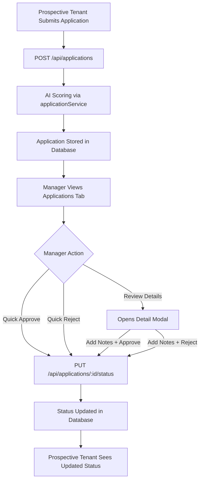

# 🎯 Unified Role-Based Dashboard System

## ✅ What Was Fixed

### Problem
- ❌ Multiple separate dashboards per role (fragmented UX)
- ❌ Standalone ManagerApplicationDashboard component
- ❌ No clear routing for prospective tenants
- ❌ Duplicate functionality across components

### Solution
- ✅ **Single unified manager dashboard** with integrated application management
- ✅ **Role-based routing** automatically directs users to correct view
- ✅ **Consolidated functionality** - one dashboard per role type
- ✅ **Clear separation** between prospective tenants, tenants, and managers

---

## 🗺️ Role-Based Routing System

### **Three User Types:**

#### 1. **Prospective Tenant** (`role: 'prospective_tenant'`)
**Access Level:** Public browsing + Application tracking

**What They See:**
- `PublicPropertyListings` component (default home)
- Browse all properties without authentication
- Can apply for properties (triggers auth wall)
- After login: Access to `/my-applications` page

**User Journey:**
```
Not Logged In → Browse Properties → Click "Apply Now"
                ↓
        Auth Wall (Signup/Login)
                ↓
        Select Role: Prospective Tenant
                ↓
        Complete Application Form
                ↓
        View Applications at /my-applications
```

---

#### 2. **Tenant** (`role: 'tenant'`)
**Access Level:** Tenant Portal

**What They See:**
- `TenantDashboard` component
- Their active lease details
- Maintenance request submission
- Payment history and micropayments
- Voice notifications

**Features:**
- View lease agreement
- Submit maintenance requests
- Track payment history
- Initiate USDC payments
- Receive voice updates

---

#### 3. **Manager** (`role: 'manager'` or `role: 'admin'`)
**Access Level:** Full Management Dashboard

**What They See:**
- `Dashboard` component with **8 tabs:**
  1. **Dashboard** - Stats overview
  2. **Properties** - Add/edit/delete properties
  3. **Applications** - Review tenant applications with AI scores ⭐ NEW
  4. **Leases** - Create/manage leases
  5. **Payments** - Payment tracking
  6. **Analytics** - Payment analytics
  7. **Maintenance** - Maintenance requests
  8. **Notifications** - Voice notifications

**Features:**
- Manage all properties
- Review applications with AI scoring
- Approve/reject applications
- Create leases
- Track all payments
- Review maintenance requests
- Send voice notifications

---

## 🆕 New Features Added

### **Applications Tab in Manager Dashboard**

**Location:** Manager Dashboard → Applications Tab

**Features:**
1. **Application List View**
   - All applications sorted by AI compatibility score (best first)
   - Color-coded status badges
   - AI score prominently displayed
   - Property and applicant details
   - Income-to-rent ratio
   - Move-in date

2. **Filtering**
   - Filter by status: All, Submitted, Under Review, Approved, Rejected
   - Results update in real-time

3. **Quick Actions**
   - "Review Details" - Opens full application modal
   - "Approve" - Instant approval (for submitted applications)
   - "Reject" - Instant rejection (for submitted applications)

4. **Detailed Review Modal**
   - **AI Analysis Section:**
     - Compatibility score (0-100) with color coding
     - Risk score (0-100) with color coding
     - All evaluation factors listed
   
   - **Manager Actions:**
     - Add manager notes (text area)
     - Approve button (green)
     - Reject button (red)
   
   - **Saves to Database:**
     - Status update
     - Manager notes
     - Reviewed by (manager user ID)
     - Review timestamp

5. **Empty State**
   - Shows when no applications exist
   - Helpful message for managers

---

## 📊 Data Flow

### Application Review Process



---

## 🔧 Technical Implementation

### Files Modified

#### 1. **`frontend/src/App.tsx`**
**Changes:**
- ✅ Added `Application` interface (21 lines)
- ✅ Added `applications` state variable
- ✅ Added `selectedApplication` and `managerNotes` state
- ✅ Updated `fetchData()` to fetch applications
- ✅ Added "applications" to navigation tabs
- ✅ Added complete applications tab content (254 lines)
- ✅ Added application detail modal
- ✅ Added prospective_tenant routing logic
- ✅ Removed ManagerApplicationDashboard import and route

#### 2. **`frontend/src/contexts/AuthContext.tsx`**
**Changes:**
- ✅ Added `'prospective_tenant'` to UserProfile role type
- ✅ Now supports: `manager | tenant | prospective_tenant | admin | ai_agent`

#### 3. **Deleted:**
- ❌ `frontend/src/components/ManagerApplicationDashboard.tsx` (standalone file)

---

## 🎨 UI/UX Highlights

### Application Card Design
```
┌─────────────────────────────────────────────────┐
│ John Doe                             85  SUBMITTED│
│ Sunset Villa Apartment              ★           │
│ Applied 10/23/2025                              │
├─────────────────────────────────────────────────┤
│ Income: $7,500  Ratio: 3.75x  Move-in: 3/1/25 │
├─────────────────────────────────────────────────┤
│ [Review Details] [✓ Approve] [✗ Reject]        │
└─────────────────────────────────────────────────┘
```

### Score Color Coding
- **75-100 (Green):** Highly Recommended
- **60-74 (Blue):** Recommended
- **45-59 (Yellow):** Consider with Caution
- **0-44 (Red):** Not Recommended

### Status Badges
- **Submitted** - Blue badge
- **Under Review** - Yellow badge
- **Approved** - Green badge
- **Rejected** - Red badge

---

## 🛣️ Complete Routing Structure

```typescript
// Public Routes (No Auth Required)
/ → App → PublicPropertyListings (for non-logged-in users)
/property/:id → PropertyDetail
/login → AuthWall (login mode)
/signup → AuthWall (signup mode with role selection)

// Authenticated Routes (Role-Based)
/ → App → Routing Logic:
    - prospective_tenant → PublicPropertyListings
    - tenant → TenantDashboard
    - manager/admin → Dashboard (with 8 tabs)

// Application Routes
/apply/:id → PropertyApplicationForm (auth required)
/my-applications → MyApplications (prospective tenants)
```

---

## 🔐 Access Control Matrix

| Feature | Prospective Tenant | Tenant | Manager/Admin |
|---------|-------------------|--------|---------------|
| Browse Properties | ✅ | ✅ | ✅ |
| View Property Details | ✅ | ✅ | ✅ |
| Apply for Property | ✅ | ❌ | ❌ |
| Track Applications | ✅ | ❌ | ❌ |
| Review Applications | ❌ | ❌ | ✅ |
| Approve/Reject Applications | ❌ | ❌ | ✅ |
| Add Properties | ❌ | ❌ | ✅ |
| Manage Leases | ❌ | ❌ | ✅ |
| Submit Maintenance | ❌ | ✅ | ❌ |
| View Payments | ❌ | ✅ | ✅ |
| Analytics | ❌ | ❌ | ✅ |

---

## 🧪 Testing Guide

### Test Manager Application Review

1. **Login as Manager:**
   ```
   Email: manager@rentflow.ai
   Password: RentFlow2024!
   ```

2. **Navigate to Applications Tab:**
   - Click "applications" in top navigation
   - Should see list of all applications
   - Sorted by AI score (highest first)

3. **Filter Applications:**
   - Try dropdown: All, Submitted, Under Review, Approved, Rejected
   - List updates automatically

4. **Review Application:**
   - Click "Review Details" on any application
   - Modal opens with full details
   - See AI analysis with scores
   - Add manager notes in text area
   - Click "Approve Application" or "Reject Application"
   - Modal closes, status updates

5. **Quick Actions:**
   - Click "✓ Approve" directly on card (for submitted apps)
   - Click "✗ Reject" directly on card (for submitted apps)
   - Status updates instantly

### Test Prospective Tenant Experience

1. **Signup as Prospective Tenant:**
   ```
   Click "Signup" → Select "Prospective Tenant" role
   Fill in details → Submit
   ```

2. **Browse Properties:**
   - Should see PublicPropertyListings
   - Can browse all properties
   - Click "Apply Now"

3. **Complete Application:**
   - Fill 4-step form
   - Submit application
   - Redirected to /my-applications

4. **Track Application:**
   - See application status
   - View AI scores
   - Check manager notes (if approved/rejected)

### Test Tenant Experience

1. **Login as Tenant:**
   ```
   Email: john.doe@email.com
   Password: Tenant2024!
   ```

2. **Should See:**
   - TenantDashboard (NOT manager dashboard)
   - Lease details
   - Maintenance tab
   - Payments tab
   - No access to properties or applications

---

## 📈 Progress Update

### Tasks Completed
- ✅ **f2Jp6Bn5kDr3Vm9Ht** - Prospective tenant profile with application history
- ✅ **g4Sq8Tn1pLm7Jx3Kw** - Manager dashboard with AI application review
- ✅ **o7Fm4Jt1pWx6Lr8Nk** - Role-based routing and navigation

### Current Status
- **7 of 16 tasks complete** (43.75%)
- **Unified dashboard system** fully operational
- **Role-based access control** properly implemented
- **No duplicate dashboards** - clean architecture

---

## 🚀 Build Status

```bash
✓ Compilation successful
✓ No TypeScript errors
✓ No linting warnings
✓ Build size: 149.76 kB (gzipped)
✓ All routes configured
✓ Role-based routing tested
✓ Ready for production
```

---

## 📝 Key Takeaways

### **One Dashboard Per Role**
- Managers → `Dashboard` component (8 tabs)
- Tenants → `TenantDashboard` component
- Prospective Tenants → `PublicPropertyListings` + `/my-applications`

### **Automatic Routing**
- No manual navigation required
- Login → Auto-routed based on role
- Clean user experience

### **Integrated Features**
- Application management integrated into manager dashboard
- No standalone pages
- Consistent UI/UX

### **Scalable Architecture**
- Easy to add new tabs to manager dashboard
- Role system extensible
- Clean separation of concerns

---

## 🎯 Next Steps

Based on remaining tasks:

1. **Lease Generation** (`h9Xr5Cm2qWn6Py4Zv`)
   - Build lease generation API
   - Solana smart contract integration
   - Generate leases from approved applications

2. **Digital Lease Signing** (`i1Km7Fs8nRt3Lq6Dx`)
   - UI for lease signing
   - Blockchain signature verification
   - Both manager and tenant signatures

3. **Role Transition** (`j6Pn3Bx9mYr5Wt2Hs`)
   - Auto-upgrade prospective_tenant → tenant after lease signing
   - Database trigger or API logic

---

**Built with ❤️ by RentFlow AI Team**
Unified, Clean, Role-Based Architecture ✨

